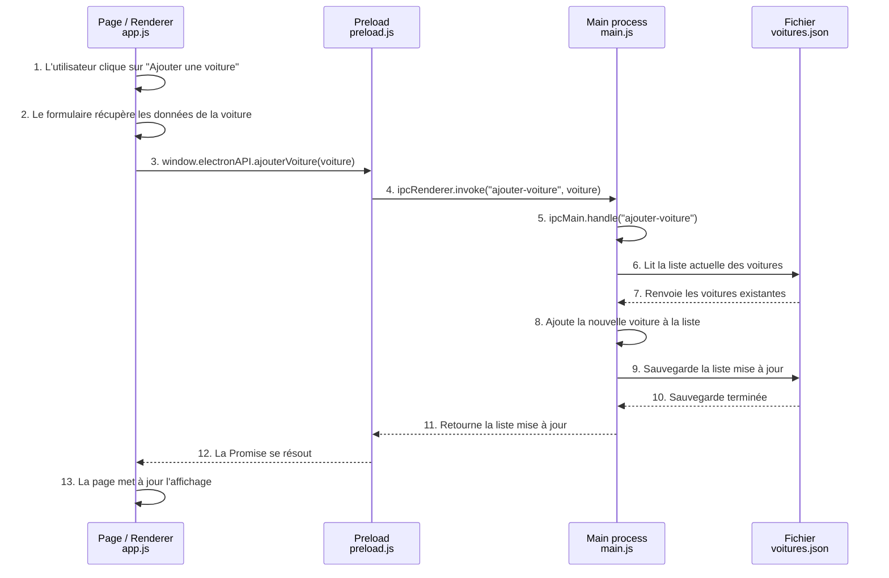

# TP Electron — Chapitre 1  
## Partie 1 — Théorie & compréhension

## A. Questions de cours

### 1. Expliquez en 2 phrases ce qu'est l'IPC, et pourquoi il existe

IPC signifie **Inter-Process Communication**, c'est-à-dire communication entre processus.

Dans Electron, l'IPC permet au **Renderer** et au **Main process** d'échanger des messages. Cela existe principalement pour des raisons de sécurité : la page ne doit pas accéder directement à Node.js, au système de fichiers ou aux données sensibles. Elle doit demander au Main de faire l'action à sa place.

---

### 2. Une app Electron a deux types de processus. Lequel a accès à Node.js / au système ? Lequel affiche l'interface ?

Le **Main process** a accès à Node.js et au système.

Le **Renderer process** affiche l'interface utilisateur avec HTML, CSS et JavaScript. Il n'a pas accès directement à Node.js ni au système de fichiers.

---

### 3. Donnez le rôle, en une ligne chacun, de : `package.json`, `main.js`, `preload.js`, le fichier de la page

- `package.json` : contient la configuration du projet, les dépendances, les scripts npm et le point d'entrée de l'application Electron.
- `main.js` : correspond au Main process. Il démarre l'application, crée les fenêtres et gère la logique système.
- `preload.js` : sert de pont sécurisé entre le Main et le Renderer. Il expose uniquement les fonctions autorisées à la page.
- Fichier de la page (`index.html` / `app.js`) : affiche l'interface et gère les actions utilisateur côté Renderer.

---

### 4. À quoi sert `contextBridge` ? Que se passerait-il si on mettait `nodeIntegration: true` ?

`contextBridge` permet d'exposer une API contrôlée dans le `window` de la page, par exemple `window.electronAPI`.

Il sert à donner au Renderer seulement les fonctions nécessaires, sans lui donner accès à tout Node.js.

Si on mettait `nodeIntegration: true`, la page pourrait utiliser directement Node.js avec `require`, `fs`, etc. Ce serait dangereux, car un script malveillant exécuté dans la page pourrait lire, modifier ou supprimer des fichiers sur la machine.

La bonne configuration est donc :

```js
contextIsolation: true,
nodeIntegration: false
```

---

### 5. Quelle est la différence entre `invoke/handle` et `send/on` ? Donnez un exemple d'usage pour chacun.

`invoke/handle` sert quand la page demande quelque chose au Main et attend une réponse.

Exemple : la page demande la liste des voitures du garage.

```js
ipcRenderer.invoke('charger-voitures')
ipcMain.handle('charger-voitures', () => {
  return chargerVoitures()
})
```

`send/on` sert quand le Main envoie une information à la page sans attendre de réponse.

Exemple : le Main envoie l'avancement d'un import pour mettre à jour une barre de progression.

```js
win.webContents.send('progression-import', 50)
ipcRenderer.on('progression-import', (event, pourcentage) => {
  console.log(pourcentage)
})
```

---

### 6. C'est quoi un canal dans l'IPC ? Quelle règle absolue le concerne ?

Un canal IPC est le nom du message utilisé pour communiquer entre le preload et le Main.

On peut le comparer à l'URI d'une route dans une API.

La règle absolue est que le nom du canal doit être strictement identique des deux côtés.

Exemple correct :

```js
ipcRenderer.invoke('charger-voitures')
ipcMain.handle('charger-voitures', () => {})
```

Exemple incorrect :

```js
ipcRenderer.invoke('charger-voitures')
ipcMain.handle('charger-voiture', () => {})
```

---

## B. Le bon outil pour le bon besoin

### 1. La page veut afficher la liste des voitures du garage

Réponse : `invoke/handle`.

Justification : la page demande une information au Main et attend une réponse.

---

### 2. Une sauvegarde longue est terminée → l'app veut afficher « Sauvegardé ✅ » toute seule

Réponse : `send/on`.

Justification : le Main prévient la page quand la sauvegarde est terminée. La page ne demande pas forcément l'information à ce moment-là.

---

### 3. L'utilisateur clique « Supprimer » et veut savoir si ça a réussi

Réponse : `invoke/handle`.

Justification : la page demande au Main de supprimer une voiture, puis elle attend une réponse pour savoir si l'action a réussi.

---

### 4. Un import de fichier avance et veut mettre à jour une barre de progression en direct

Réponse : `send/on`.

Justification : le Main envoie plusieurs messages à la page au fur et à mesure de l'import. C'est un flux d'informations en direct.

---

## C. Trouvez le bug

## C1 — Au clic, rien ne revient

### Code donné

```js
// preload.js
chargerVoitures: () => ipcRenderer.invoke('charger-voitures'),

// main.js
// ... createWindow(), app.whenReady() ...
// (rien d'autre)

// app.js
const liste = await window.electronAPI.chargerVoitures();
```

### Problème

Le preload envoie une demande avec `ipcRenderer.invoke('charger-voitures')`, mais le Main n'a aucun `ipcMain.handle('charger-voitures')`.

La page attend donc une réponse qui n'arrive jamais.

### Correction

Il faut ajouter un handler dans le Main sur le même canal.

```js
ipcMain.handle('charger-voitures', () => {
  return chargerVoitures();
});
```

---

## C2 — Le bouton « Ajouter » ne fait rien du tout

### Code donné

```js
// preload.js
ajouterVoiture: (v) => ipcRenderer.invoke('ajouter-voiture', v),

// main.js
ipcMain.handle('ajout-voiture', (e, v) => { /* ... */ });
```

### Problème

Les noms des canaux ne sont pas identiques.

Dans le preload, le canal est :

```js
'ajouter-voiture'
```

Dans le Main, le canal est :

```js
'ajout-voiture'
```

Electron considère que ce sont deux canaux différents.

### Correction

Il faut utiliser exactement le même nom des deux côtés.

```js
// preload.js
ajouterVoiture: (v) => ipcRenderer.invoke('ajouter-voiture', v),

// main.js
ipcMain.handle('ajouter-voiture', (e, v) => {
  // logique d'ajout
});
```

---

## C3 — L'écran affiche `[object Promise]`

### Code donné

```js
// app.js
const liste = window.electronAPI.chargerVoitures();
zone.textContent = liste;
```

### Problème

`chargerVoitures()` utilise `invoke`, donc elle renvoie une Promise.

Comme il manque `await`, la page affiche la Promise au lieu du résultat.

### Correction

Il faut mettre `await` dans une fonction `async`.

```js
const liste = await window.electronAPI.chargerVoitures();
zone.textContent = JSON.stringify(liste, null, 2);
```

Ou mieux, parcourir la liste pour l'afficher proprement dans le HTML.

---

## C4 — `window.electronAPI` est `undefined` dans la page

### Code donné

```js
// main.js
const win = new BrowserWindow({
  width: 900, height: 600
  // webPreferences ... ?
});
win.loadFile('index.html');
```

### Problème

Le preload n'est pas branché dans la fenêtre.

Donc le `contextBridge` ne peut pas exposer `window.electronAPI` à la page.

### Correction

Il faut ajouter `webPreferences` avec le chemin vers `preload.js`.

```js
const path = require('path');

const win = new BrowserWindow({
  width: 900,
  height: 600,
  webPreferences: {
    preload: path.join(__dirname, 'preload.js'),
    contextIsolation: true,
    nodeIntegration: false
  }
});

win.loadFile('index.html');
```

---

## C5 — Ça « marche »… mais c'est une faille de sécurité

### Code donné

```js
// main.js
const win = new BrowserWindow({
  webPreferences: { nodeIntegration: true, contextIsolation: false }
});

// ... et dans la page :
const fs = require('fs');
fs.readFileSync(...);
```

### Problème

Le Renderer a accès directement à Node.js.

Cela viole le principe de sécurité du cours : la page ne doit jamais accéder directement au système de fichiers.

### Risque concret

Si un script malveillant arrive dans la page, il pourrait utiliser Node.js pour lire des fichiers sensibles, modifier des fichiers, supprimer des données ou exécuter du code dangereux.

### Correction propre

Il faut garder :

```js
contextIsolation: true,
nodeIntegration: false
```

Puis exposer seulement les fonctions nécessaires avec `contextBridge` dans le preload.

Exemple :

```js
// preload.js
contextBridge.exposeInMainWorld('electronAPI', {
  chargerVoitures: () => ipcRenderer.invoke('charger-voitures')
});
```

Et côté Main :

```js
// main.js
ipcMain.handle('charger-voitures', () => {
  return chargerVoitures();
});
```

---

## D. Schéma — Trajet complet d'un clic sur « Ajouter une voiture »



Résumé du trajet :

1. L'utilisateur clique sur le bouton dans la page.
2. Le Renderer récupère les données du formulaire.
3. Le Renderer appelle une fonction exposée par le preload.
4. Le preload envoie une demande IPC au Main.
5. Le Main reçoit la demande avec `ipcMain.handle`.
6. Le Main lit ou modifie le fichier de données.
7. Le Main sauvegarde la voiture.
8. Le Main renvoie le résultat.
9. Le Renderer met à jour l'interface.

La page ne touche jamais directement au fichier. Tout passe par le Main process via le preload et l'IPC.